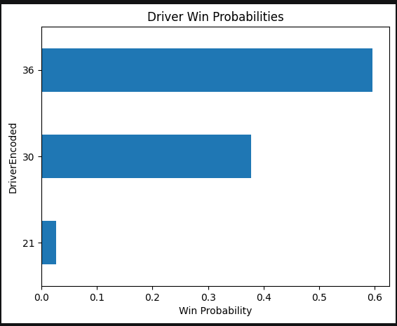
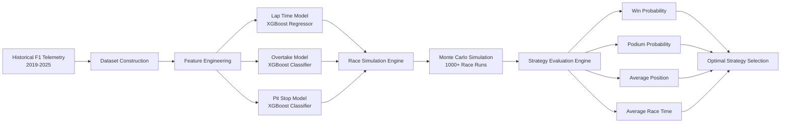
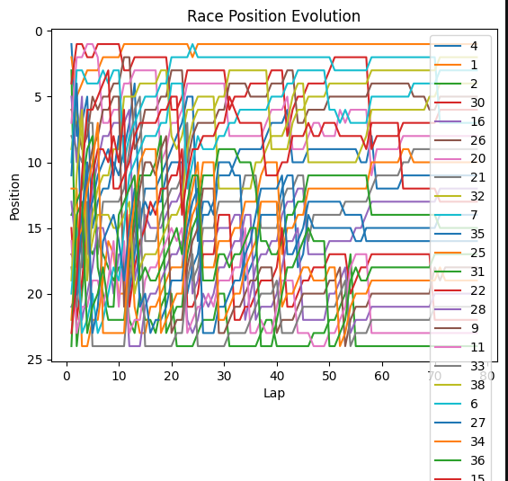
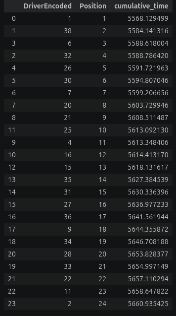
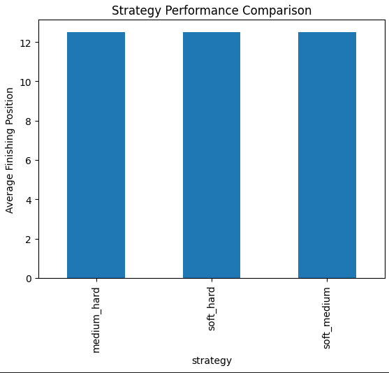

# F1 AI Race Strategy Simulator

AI-driven Formula 1 race strategy optimization system using historical telemetry, machine learning, race simulation, and Monte Carlo analysis.

## Overview

This project implements an AI-driven Formula 1 race strategy platform that uses historical telemetry, machine learning, race simulation, and Monte Carlo analysis to evaluate and optimize race strategies.

The system uses multi-season Formula 1 telemetry collected through FastF1 and transforms raw race data into machine-learning features representing tyre degradation, fuel load, traffic conditions, DRS opportunities, and pace evolution.

Three machine learning models are trained to predict lap times, overtaking probability, and pit-stop decisions. These models are integrated into a custom lap-by-lap race simulation engine that dynamically updates race state throughout a simulated Grand Prix.

To account for uncertainty and race variability, the simulator performs Monte Carlo analysis by running hundreds of races and estimating probabilistic outcomes such as win probability, podium probability, and average finishing position.

The final strategy engine compares alternative tyre compounds and pit-stop plans to identify the most effective race strategy under uncertainty.

---
## Demonstration

<p align="center">
  
</p>

## System Architecture


---
## Results
### Race Simulation

<p align="center">
  
</p>
Position evolution of drivers during a simulated Grand Prix.

## Monte Carlo Analysis

<p align="center">
  
</p>
Monte Carlo analysis showing probabilistic race outcomes.

## Strategy Optimization

<p align="center">
  
</p>
Comparison of alternative tyre and pit-stop strategies.

## Key Features

### Telemetry Processing

* Historical Formula 1 telemetry collection using FastF1
* Multi-season race dataset generation
* Weather and track condition integration
* Lap-level race state reconstruction

### Feature Engineering

* Tyre degradation modeling
* Fuel load estimation
* Pace trend analysis
* DRS availability detection
* Traffic and gap modeling
* Track evolution features

### Lap Time Prediction

* XGBoost regression model
* Track-normalized lap time prediction
* Driver and team performance modeling
* Environmental condition integration

### Overtake Prediction

* Overtake probability estimation
* DRS and gap analysis
* Relative pace evaluation
* Tyre advantage modeling

### Pit Stop Prediction

* Strategy-aware pit-stop modeling
* Stint progression analysis
* Undercut opportunity detection
* Compound degradation effects

### Race Simulation

* Lap-by-lap race execution
* Dynamic race-state updates
* Driver variability modeling
* Position evolution tracking

### Monte Carlo Analysis

* Probabilistic race outcome estimation
* Win probability calculation
* Podium probability calculation
* Top-5 probability calculation

### Strategy Optimization

* Multi-strategy comparison
* Tyre compound evaluation
* Pit-stop timing optimization
* Race-time minimization

---

## Machine Learning Models

### Lap Time Model

**Algorithm:** XGBoost Regressor

Predicts lap-time delta relative to track baseline using:

* Driver performance
* Team performance
* Tyre age
* Fuel load
* Traffic conditions
* Environmental factors

### Overtake Model

**Algorithm:** XGBoost Classifier

Predicts:

```text
P(Overtake)
```

Using:

* Gap to car ahead
* Relative pace
* Tyre advantage
* DRS availability
* Track overtaking characteristics

### Pit Stop Model

**Algorithm:** XGBoost Classifier

Predicts:

```text
P(Pit Stop Next Lap)
```

Using:

* Tyre age
* Stint progression
* Pace degradation
* Race position
* Traffic pressure
* Undercut opportunities

---

## Monte Carlo Simulation

The simulator runs the same race repeatedly while introducing stochastic race events.

Sources of randomness include:

* Driver performance variation
* Pit-stop decisions
* Overtake outcomes
* Race pace fluctuations

Typical simulation scale:

```text
1000+ Race Simulations
```

Generated metrics:

* Win Probability
* Podium Probability
* Top-5 Probability
* Average Finishing Position

---

## Strategy Evaluation

The strategy engine evaluates alternative tyre and pit-stop plans.

Example strategies:

```text
Soft → Medium
Medium → Hard
Soft → Hard
```

Each strategy is evaluated through repeated race simulations.

Performance metrics:

| Metric             | Description                       |
| ------------------ | --------------------------------- |
| Win Probability    | Probability of winning the race   |
| Podium Probability | Probability of finishing in top 3 |
| Average Position   | Mean finishing position           |
| Average Race Time  | Mean total race duration          |

---

## Project Structure

```text
F1-RACE-STRATEGY-ENGINE/

├── backend/
│   └── main.py
│
├── notebooks/
│   ├── 01_build_dataset.ipynb
│   ├── 02_feature_engineering.ipynb
│   ├── 03_lap_time_model.ipynb
│   ├── 04_overtake_model.ipynb
│   ├── 05_pit_stop_model.ipynb
│   ├── 06_race_simulator.ipynb
│   ├── 07_monte_carlo_simulation.ipynb
│   └── 08_strategy_engine.ipynb
│
├── models/
│   ├── lap_time_model.pkl
│   ├── overtake_model.pkl
│   └── pit_stop_model.pkl
│
├── dashboard.py
├── prepare_replay.py
├── race_replay.json
│
└── data/
```

---

## Pipeline Overview

| Notebook | Purpose                         |
| -------- | ------------------------------- |
| 01       | Historical telemetry collection |
| 02       | Feature engineering             |
| 03       | Lap time prediction model       |
| 04       | Overtake probability model      |
| 05       | Pit-stop prediction model       |
| 06       | Race simulation engine          |
| 07       | Monte Carlo analysis            |
| 08       | Strategy optimization           |

---

## Installation

```bash
git clone https://github.com/yuvanbruh/F1-race-strategy-engine.git

cd F1-race-strategy-engine

pip install -r requirements.txt
```

---

## Usage

Run notebooks sequentially:

```text
01_build_dataset.ipynb
        ↓
02_feature_engineering.ipynb
        ↓
03_lap_time_model.ipynb
        ↓
04_overtake_model.ipynb
        ↓
05_pit_stop_model.ipynb
        ↓
06_race_simulator.ipynb
        ↓
07_monte_carlo_simulation.ipynb
        ↓
08_strategy_engine.ipynb
```

---

## Technologies Used

* Python
* FastF1
* Pandas
* NumPy
* Scikit-learn
* XGBoost
* Matplotlib
* Monte Carlo Simulation
* Machine Learning
* Predictive Modeling

---

## Future Work

* Reinforcement Learning Strategy Optimization
* Dynamic Safety Car Modeling
* Weather Forecast Integration
* Driver-Specific Aggression Models
* Multi-Race Championship Simulation
* Real-Time Strategy Recommendation System

---

## Author

**Yuvan Ashrith**

Mechanical Engineering Undergraduate

University College of Engineering, Osmania University
